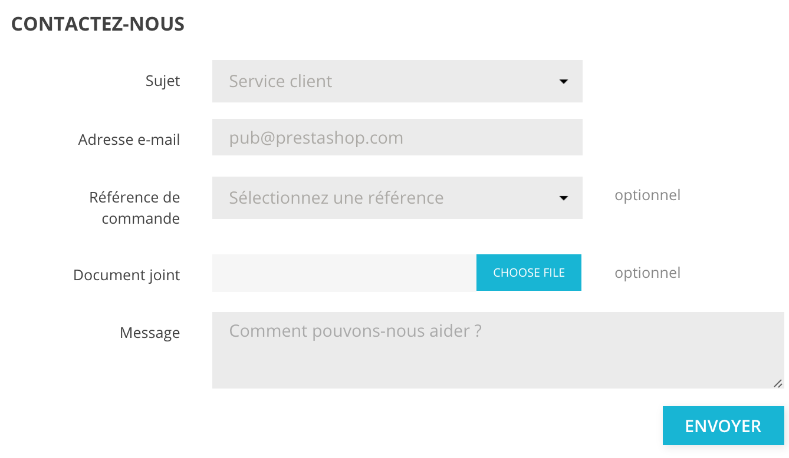
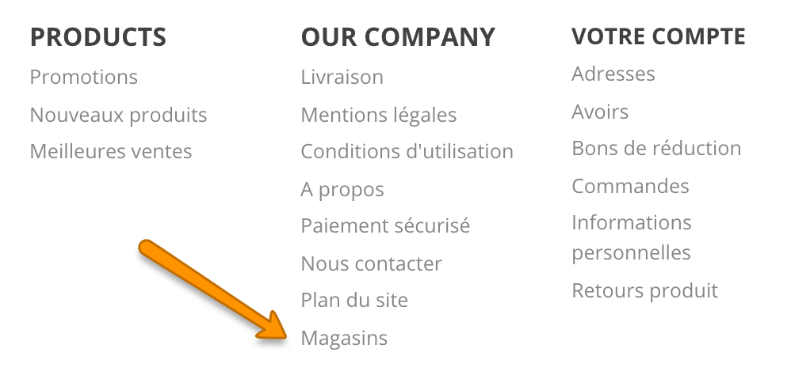
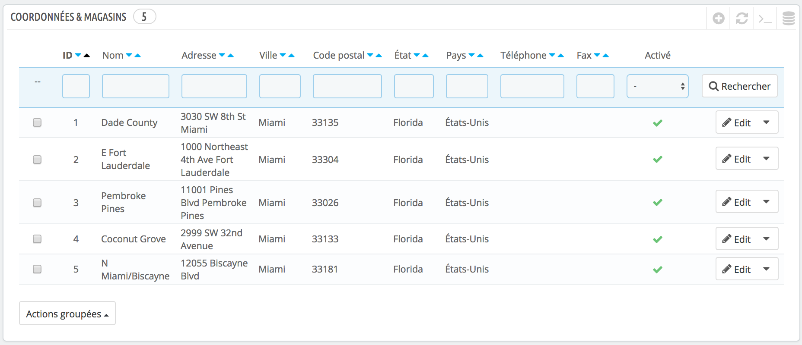
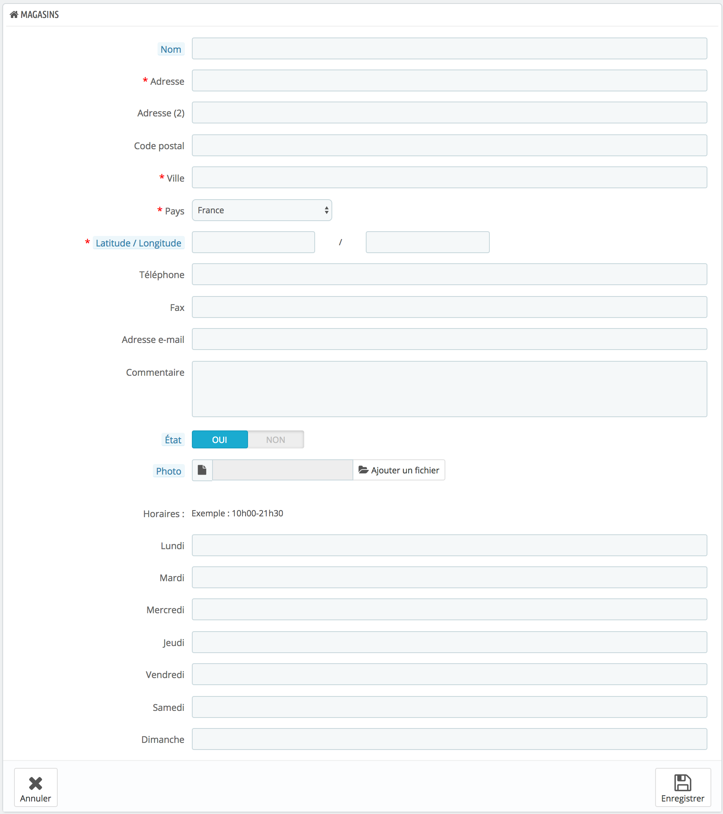
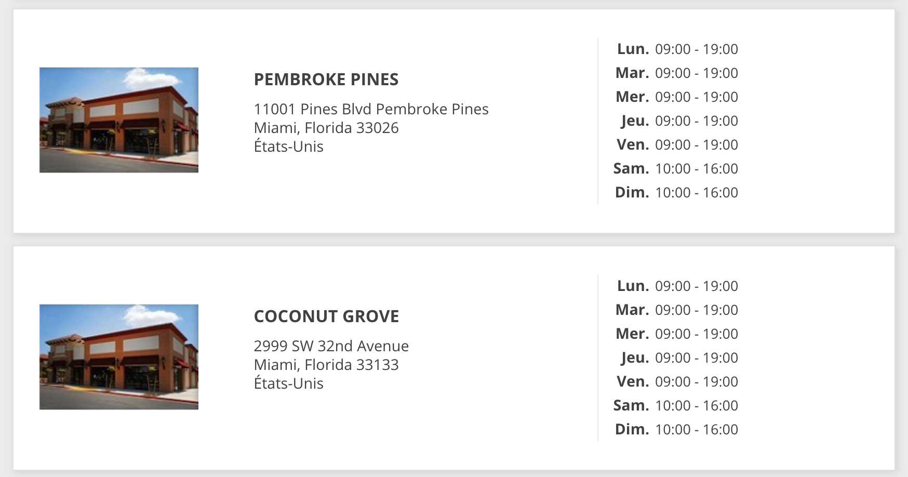
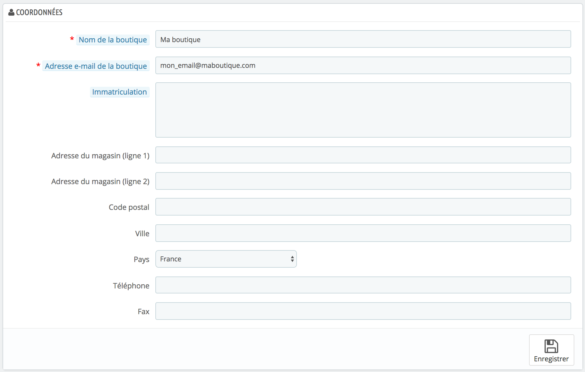

# Gestion des contacts

Votre boutique offre plusieurs points de contact à vos clients, que ce soit via le formulaire de contact, ou la liste de vos boutiques physiques (si vous en avez). Ces pages vous permettent de gérer toutes vos informations de contact.

## Vos contacts&#x20;

La page "Nous contacter" de votre boutique contient un formulaire de contact pour que vos clients puissent vous envoyer des messages facilement. En fonction du type de demande adressée, ces messages peuvent être envoyés à différents interlocuteurs, pour que la bonne personne parmi votre équipe traite ces demandes.

Vous pouvez ainsi créer de nombreux comptes de contacts. Par exemple : service client, service technique, service commercial, etc. Vous les trouver sur la page "Contacts".

### Créer de nouveaux contacts

Pour que les messages soient bien envoyés aux bons destinataires, vous devez configurer les contacts de votre boutique.

Cliquez sur "Ajouter un contact" pour accéder au formulaire de contact :

* **Titre**. Le nom du contact : soit le nom d'une personne, soit le nom du service lui-même. Vous pouvez également choisir d'utiliser une phrase, comme "J'ai un problème avec ma commande", "Je veux renvoyer un produit" ou "Proposition de partenariat", car ce titre est visible par vos clients sur le formulaire.
* **Adresse e-mail**. L'adresse peut être la même que celle d'un autre contact. Qui plus est, tous les contacts peuvent avoir la même adresse si vous n'avez pas vraiment d'équipe – les clients ne le sauront jamais, mais avoir de nombreux contacts peut les aider à avoir confiance en votre boutique, car cela signifie que de nombreuses personnes y travaillent.
* **Enregistrer les messages ?**. Indiquez si les messages doivent être enregistrés dans l'outil de gestion SAV, ou juste être envoyés par e-mail. Si cette option est désactivée, PrestaShop ne vous aidera pas à gérer les messages pour ce contact. Cela peut se révéler utile pour un contact comme "Proposition de partenariat", car vous pourriez préférer que ces messages arrivent directement dans votre boite e-mail sans être lisible par toute votre équipe.
* **Description**. Choisissez une description courte, ne dépassant pas la ligne, car elle peut être affichée au client sur le formulaire de contact (en fonction de votre thème).

### Comment les clients peuvent vous contacter

Pour contacter la bonne équipe d'employés depuis votre front-office, le client doit cliquer soit sur le lien "Contactez-nous" en haut de la page, ou le lien "Nous contacter" en bas de la page. Le formulaire de contact s'ouvre alors.

Le client peut ensuite choisir le service à contacter, saisir son adresse e-mail puis son message. Un menu déroulant lui permet d'indiquer la commande dont il est en train de parler, et même le produit dont il parle.

Le module "Coordonnées" permet d'afficher vos coordonnées dans le footer de votre boutique, ainsi que sur la page "Nous contacter". Les coordonnées sont modifiables dans l'onglet "Coordonnées et magasins".

## Coordonnées et magasins

PrestaShop vous permet de lister vos magasins physiques, avec des informations de contact détaillées, via la page "Magasins" de votre boutique (accessible via le footer).

De toute évidence, cette fonctionnalité n'est réellement utile que si vous avez des magasins physiques, où les clients peuvent acheter vos produits.

Vous ne pouvez pas supprimer cette page, par contre vous pouvez la rendre inaccessible à vos visiteurs :

* Désactivez ou supprimez toutes les boutiques de la page "Coordonnées et magasins"
* Désactivez le lien du footer. Dans la page "Gestion des liens" du menu "Apparences", supprimer le lien "Magasins" du bloc "Notre entreprise".

A ce stade, la page existe toujours et est toujours visible par les moteurs de recherche. Pour la supprimer pour de bon, vous devez

* Aller dans la page Trafic & SEO
* Trouver la page "Magasins"
* La supprimer

Si jamais vous aviez besoin de recréer cette page par la suite, vous pouvez le faire en ajoutant une nouvelle page dans "SEO & URLs", avec les informations suivantes :

* Nom de la page : choisissez "magasins"
* Titre de la page : "Magasins"
* URL réécrite : "magasins"

### Liste des magasins

Vous pouvez choisir la manière dont ces magasins sont affichés. Les clients pourront y accéder par le biais du lien "Magasins" (en fonction du thème).

Tous les magasins sont listés dans une liste qui vous donne également leurs principales informations ainsi qu'un indicateur de l'activation du magasin – vous pourriez par exemple vouloir ne mettre en ligne un magasin qu'une fois que vous aurez réunis toutes les informations nécessaires.

#### Ajouter un nouveau magasin

Comme d'habitude, cliquez sur le bouton "Ajouter un magasin" pour ouvrir le formulaire de création.

Remplissez autant de champs que possible, car ces informations seront affichées en ligne.

Le champ "Latitude / Longitude" est important, car il indique à votre thème l'emplacement de votre magasin, pour éventuellement les afficher sur une carte. Vous pouvez utiliser l'outil en ligne de Steve Morse pour obtenir la latitude et longitude d'une adresse : [http://stevemorse.org/jcal/latlon.php](http://stevemorse.org/jcal/latlon.php).

Faites en sorte d'ajouter une photo du magasin, car elle aidera vos clients à le trouver une fois dans la rue.

Enfin, les heures d'ouverture sont une information essentielle d'un magasin physique, et vous devriez être aussi précis que possible.

## Coordonnées 

Cette section vous permet de donner plus de détails sur votre société plutôt que sur un magasin en particulier. Vous devriez remplir tous les champs avec les informations sur votre siège social, car c'est très certainement l'adresse à laquelle les clients écriront, voire se rendront.

La plupart de ces informations sont évidentes, mais certains champs doivent être attentivement remplis :

* **Téléphone**. Utilisez le numéro de contact de votre boutique. Si vous préféreriez que les clients ne vous appellent pas, ne mettez rien dans ce champ.
* **Adresse e-mail de la boutique**. L'adresse officielle de votre société. Utilisez l'adresse générale de contact de votre société, celle qui envoie des e-mails à vos clients.
* **Immatriculation**. Donnez le numéro d'enregistrement légal de votre société, qui dépend du système légal de votre pays (SIRET en France, Duns number aux USA, CNPJ au Brésil, etc.).\
  Cela prouve que vous êtes une société officiellement déclarée, ce qui vous permet de gagner la confiance de vos clients.
* **Adresse du magasin**, **Code postal**, **Ville**, **État**, **Pays**. Utilisez l'adresse de contact officielle de votre société. L'option "État" n'apparaît que si le pays sélectionné a des états dans votre base de données (par le biais de la page "États" du menu "Localisation".
* **Téléphone**. Le numéro de contact officiel de votre société. Si vous préférez que les utilisateurs ne vous contactent pas, ne mettez rien ici.
* **Fax**. Le numéro de fax officiel de votre société.
