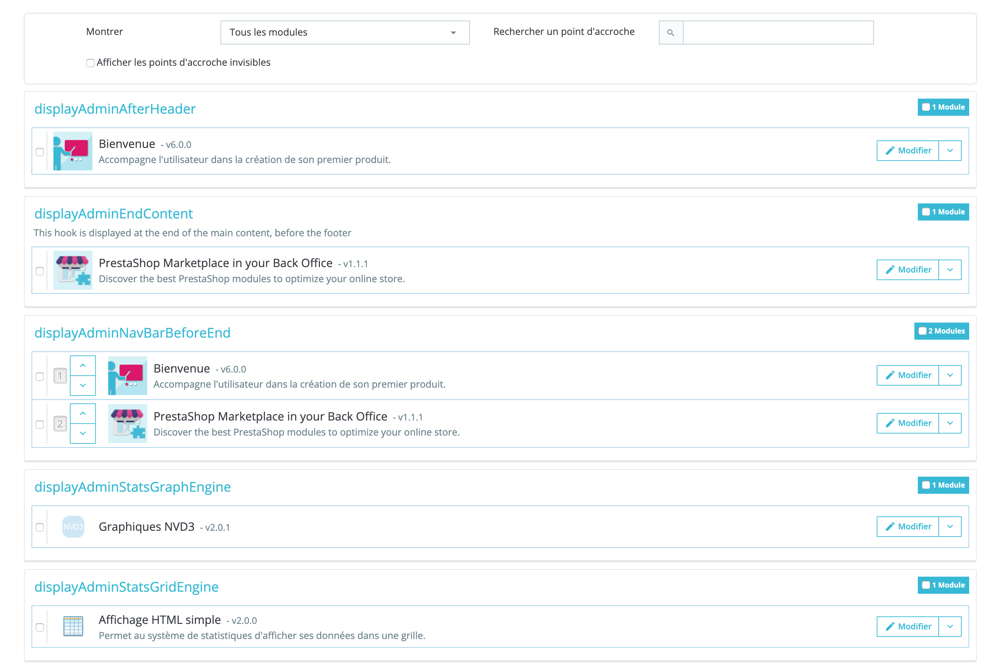
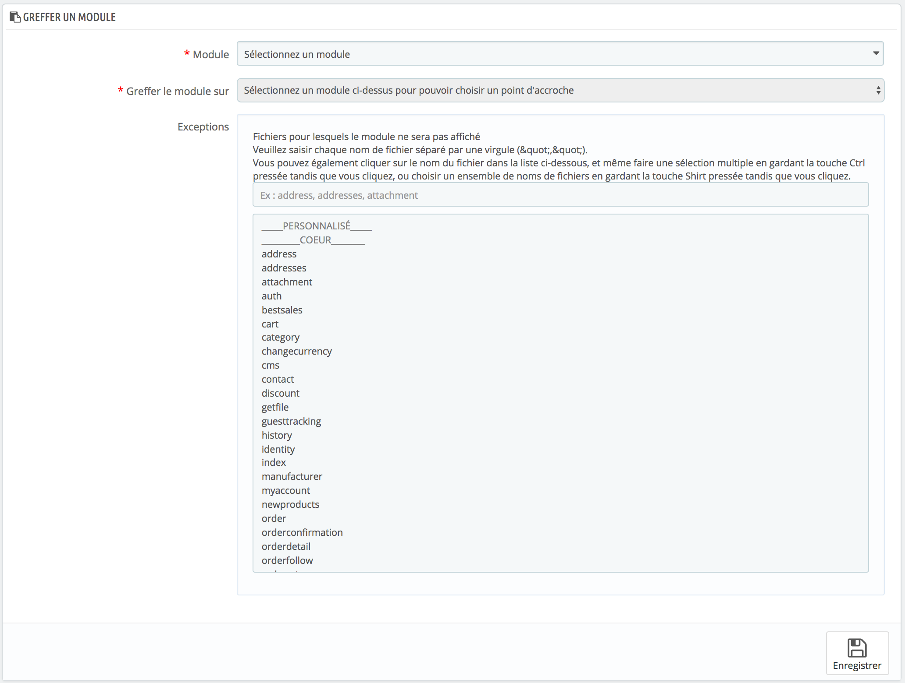

# Positions des modules

Un module peut avoir deux vues : une vue sur le back office (ses options, ou même son écran de configuration) et l'autre sur le front office. La partie du front office correspond à la manière et l'endroit où le module s'affichera sur le thème de votre boutique.

L'ordre dans lequel les modules apparaissent sur votre thème peut être personnalisé car vous pouvez par exemple souhaiter que le bloc d'un module soit placé plus haut (ou plus bas) dans une section par rapport à d'autres. Dans le jargon PrestaShop, cette démarche est appelée "greffe" (en anglais, _transplanting_) et se pratique en utilisant l'outil disponible depuis la page "Positions" du menu "Apparence". Dans les faits, cela vous permet d'attacher un module à l'un des nombreux points d'accroche disponibles dans le thème actuel, sans écrire de code.

La page "Positions" affiche tous les points d'accroche disponibles ainsi que leurs modules correspondants. Beaucoup des points d'accroche sont vides par défaut, et les plus utilisés ont facilement une douzaine de modules.



En haut de la page, un menu déroulant vous permet de n'afficher que les modules qui vous intéressent. Vous pouvez également rechercher un point d'accroche précis via la barre de recherche. Par défaut, cette liste n'affiche que les points d'accroche sur lesquels vous pouvez positionner des fonctions. Cochez la case "Afficher les points d'accroche invisibles" permet l'affichage de tous les points d'accroche, même ceux dits invisibles, qui sont liés à une action par exemple.

L'en-tête de chaque tableau de point d'accroche affiche le nom du point d'accroche, une courte description (si disponible) et le nombre de modules attachés. Le tableau liste tous les modules attachés. Les modules sont présentés dans l'ordre avec lequel ils apparaissent sur le point d'accroche.

## Déplacer un module sur un point d'accroche <a href="#positionsdesmodules-deplacerunmodulesurunpointdaccroche" id="positionsdesmodules-deplacerunmodulesurunpointdaccroche"></a>

Il existe deux manières de déplacer un module à l'intérieur d'un point d'accroche :

* Cliquez sur la flèche montante ou descendante. La page sera réactualisée et affichera le nouvel ordre.
* Glissez et déposez la ligne correspondant au module :
  1. Placez le curseur sur le numéro de position et maintenez le bouton de la souris cliqué.
  2. Bougez le curseur jusqu'à la position désirée : la ligne du module sera déplacée vers cette position.
  3. Relâchez maintenant le bouton de la souris : la position est maintenant enregistrée.

Pour la plupart des modules, la greffe peut être effectuée facilement depuis le back office. Certains modules nécessitent de modifier le code afin de transplanter le module.

## Attacher un module à un point d'accroche : la greffe <a href="#positionsdesmodules-attacherunmoduleaunpointdaccroche-lagreffe" id="positionsdesmodules-attacherunmoduleaunpointdaccroche-lagreffe"></a>

Au sein de PrestaShop, l'action de "greffer" un module consiste à l'attacher à un point d'accroche. Vous pouvez greffer un module à plus d'un point d'accroche.

Deux choses à savoir avant de greffer un module :

* Certains modules sont conçus pour ne pouvoir être greffés qu'à certains points d'accroche.
* Certains points d'accroche sont conçus pour n'accepter que certains modules.

De fait, restez conscient que vous ne pouvez pas toujours greffer n'importe quel module à n'importe quel point d'accroche.

Assurez-vous de désactiver le cache lorsque vous testez les effets d'un nouveau module sur le front. Vous pouvez le désactiver en vous rendant sur la page "Performances" du menu "Paramètres avancés".

Le processus de greffe dispose de sa propre interface :

1. Allez sur la page "Positions" du menu "Apparence".
2. Cliquez sur le bouton "Greffer un module" en haut à droite. L'interface de greffe s'affiche. De nombreux modules sont disponibles. Vous pouvez revenir sur votre choix plus tard si besoin.
3. Dans la liste déroulante "Module", choisissez le module que vous voulez greffer.
4. Dans la liste déroulante "Greffer le module sur", choisissez l'emplacement où vous voulez que le module soit greffé.
5. Dans le champ "Exceptions", saisissez le nom du(des) fichier(s) correspondant aux pages sur lesquelles vous ne voulez pas voir le module apparaître. Vous pouvez faire une sélection multiple en cliquant sur les fichiers sélectionnés tout en maintenant la touche CTRL pressée. Désélectionnez les fichiers de la même manière : CTRL + clic.
6. N'oubliez pas d'enregistrer vos modifications.\
   \




Le menu déroulant "Greffer le module sur" vous aide à savoir où le module peut être greffé.

Même si la liste déroulante donne une vision complète des points d'accroche disponible, elle peut ne pas être forcément très claire quand il s'agit de trouver un point en particulier. N'hésitez pas à essayer un autre point si le résultat de votre sélection ne donne pas le résultat attendu. La liste donne quelques détails : certains modules ont une description après leur nom, par exemple "Add fields to the form 'attribute value'" pour `displayAttributeForm`. Parcourez les tous pour trouver le bon point d'accroche.

## Modifier un module greffé <a href="#positionsdesmodules-modifierunmodulegreffe" id="positionsdesmodules-modifierunmodulegreffe"></a>

Chaque module dispose de deux boutons à la droite de sa ligne : un pour modifier ses réglages, l'autre pour dégreffer le module.

Les réglages d'un module se font dans la même interface que celle utilisée pour greffer un module. La différence principale revient à ce que vous ne pouvez modifier le champs "Module", qui est désactivé et grisé. Vous ne pouvez modifier le champs "Greffer le module sur" et le réglage des exceptions, qui fonctionne tel que décrit pour la méthode "Attacher un module à un point d'accroche" ci-dessus.


Vérifiez toujours sur votre front office que le module apparaît bien là il se doit.

## Enlever un module d'un point d'accroche. <a href="#positionsdesmodules-enleverunmoduledunpointdaccroche." id="positionsdesmodules-enleverunmoduledunpointdaccroche."></a>

Il y a deux manières d'enlever un module d'un point d'accroche :

* Enlever un seul module : cliquez sur l'icône de suppression, à droite sur la ligne du module.
* Enlever plusieurs modules : sélectionnez les modules en cochant leurs cases respectives, situées à droite sur la ligne de chaque, puis cliquez sur le bouton "Dégreffer la sélection", situé en haut et en bas de la liste des points d'accroche.

## Greffer un module en modifiant son code <a href="#positionsdesmodules-grefferunmoduleenmodifiantsoncode" id="positionsdesmodules-grefferunmoduleenmodifiantsoncode"></a>

À réserver aux experts : vous devez avoir une bonne connaissance de PHP et HTML avant de changer quoi que ce soit dans le code d'un module.

Certains modules ne peuvent être greffés dans d'autres pages car ils ne possèdent pas le code nécessaire. Par exemple, certains modules contiennent à la fois des modèles pour l'affichage des colonnes ainsi que l'affichage de l'en-tête, tandis que d'autres n'ont qu'un seul fichier de modèle qui se rapporte uniquement à la section d'en-tête.

Si vous voulez placer des modules simples vers un emplacement pour lequel il n'a pas été conçu, vous aurez à effectuer vous-même la personnalisation. Des modules plus complexes peuvent également être modifiés pour s'afficher dans d'autres sections de la page mais il vous faudra pour cela les réécrire en partie afin que leur design fonctionne avec cet emplacement.

Pour personnaliser la greffe d'un module sur un point d'accroche, vous devez lui déterminez sa fonction PHP pour le point d'accroche. Par exemple, pour un module qui a cette fonction :

```
function hookTop($params)
  {
  ...
  }
```

Ainsi, pour le greffer dans la colonne de droite, par exemple, vous devez ajouter la fonction `hookRightColumn()` :

```
function hookRightColumn($params)
  {
  ...
  }
```

Ceci fait, vous devez écrire le code qui affichera le contenu pour la page d'accueil. Au mieux, cela signifiera copier/coller le contenu de la fonction `hookTop()` ; au pire, vous devrez réécrire le contenu de la fonction `hookTop()` afin de fonctionner visuellement au nouvel emplacement.

## Widgets <a href="#positionsdesmodules-widgets" id="positionsdesmodules-widgets"></a>

La version 1.7 de PrestaShop a introduit un nouveau système pour greffer les modules : les widgets. Grâce aux widgets, un module peut être utilisé et transplanté sur n'importe quel point d'accroche.&#x20;

Les widgets fonctionnent avec les modules spécifiques à la 1.7 (les modules PrestaShop concernés ont un nom technique commençant par "ps\_") et ne peuvent pas être utilisés sur des modules antérieurs. Pour en savoir plus sur les widgets, consultez notre documentation dev (en anglais) : [https://devdocs.prestashop.com/1.7/modules/concepts/widgets/](https://devdocs.prestashop.com/1.7/modules/concepts/widgets/)
