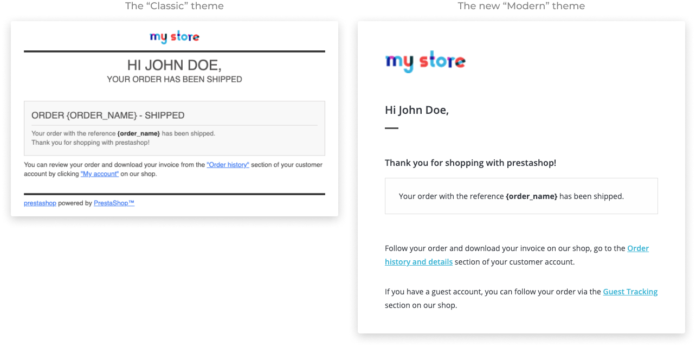
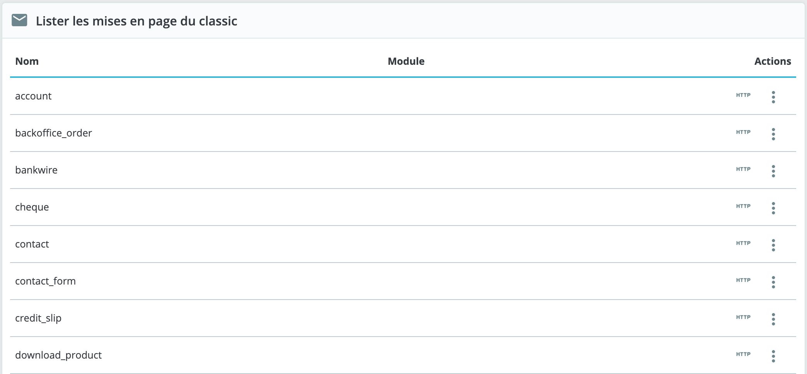

# Thèmes d'e-mail

L'importance des e-mails n'est plus à prouver : une bonne communication, un message pertinent, tout ce qui peut vous aider à garder contact avec vos clients. Pour ce faire, une nouvelle page a fait son apparition en 1.7.6 pour permettre la gestion des templates d'e-mails. Le menu "Apparence" compte donc une nouvelle entrée en la page "Thèmes d'e-mail" ! Cela vous permet ainsi de concentrer toute la gestion de vos e-mails au même endroit.

_Nouveauté depuis PrestaShop 1.7.6 !_ Auparavant, les e-mails étaient récupérés depuis le serveur, ils sont désormais générés depuis cette nouvelle page ou automatiquement à l'installation de votre boutique et/ou d'un pack de localisation.

## Paramètres 

La page est découpée en trois sections distinctes. Le premier paramètre à renseigner, c'est le thème d'e-mail que vous souhaitez avoir par défaut. Deux modèles sont disponibles nativement : le thème "Classic" et le "Modern", disponible depuis PrestaShop 1.7.6. Cela signifie que vos prochains e-mails seront envoyés selon le thème choisi ici.

## Générer des e-mails 

Pour créer vos e-mails, rien de plus simple... suivez le guide ! Choisissez votre thème d'e-mail ainsi que la langue dans laquelle vous souhaitez générer ces e-mails.

Pour bénéficier de la traduction de ces e-mails, assurez-vous d'avoir d'abord ajouté la langue souhaitée dans la partie "International" de votre back office.

Dans le cas où vous auriez besoin de remplacer les e-mails de votre thème actuel, choisissez d'abord le thème à écraser puis activez l'option suivante ("Ecraser les templates") pour valider cette action. En effet, pour éviter de supprimer par erreur votre travail, les fichiers existants ne sont pas modifiés. Il faut alors forcer l'écrasement.&#x20;

Thème d'e-mail

Cette section vous permet d'accéder à tous les modèles d'e-mails existants. Par défaut, les deux thèmes natifs "Classic" et "Modern" sont disponibles. Il suffit de cliquer sur l'icône loupe pour accéder à la liste des e-mails que comporte chaque thème. Une fois sur la page qui regroupe les différents e-mails et les liste par ordre alphabétique, plusieurs actions peuvent être effectuées depuis le menu à droite de chaque ligne :&#x20;

* **La vue HTTP.** Permet de visualiser l'e-mail tel qu'il sera envoyé, dans la mise en forme choisie.
* **La vue HTML.** Permet d'accéder au code HTML de l'e-mail tel qu'il sera envoyé.
* **La vue texte.** Permet d'accéder au texte brut de l'e-mail.
* **Envoyer un e-mail de test.** Utile pour vérifier que la mise en page est bien conforme à vos attentes.

