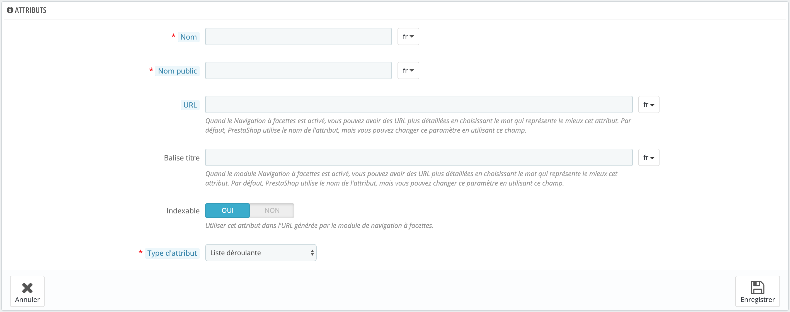
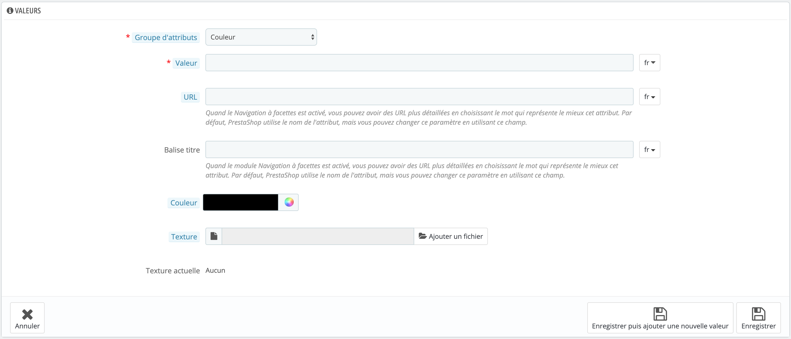

# Gérer les attributs de vos produits

Les attributs sont la base des déclinaisons de produit : vous ne pouvez créer de variations d'un produit que si au moins un de ses attributs change. Les attributs sont en quelque sorte les propriétés du produit qui sont susceptibles de changer entre chaque déclinaison, tout en conservant le même nom de produit : couleur, capacité, taille, poids, etc. Vous pouvez utiliser n'importe quel détail qui change entre les versions d'un même produit, sauf le prix.

La différence entre un attribut et une caractéristique dépend du produit lui-même. Certains produits peuvent partager la même propriété, qui pour un serait un attribut servant à construire des déclinaisons du produit, pour l'autre serait une simple caractéristique immuable. Par exemple, un client peut acheter une déclinaison d'iPad basée sur ses attributs (couleur, espace disque) mais pas ses caractéristiques (poids, taille).

De la même manière, la même boutique pourrait vendre des déclinaisons basées sur ses attributs (couleur, taille, genre) mais pas ses caractéristiques (poids). Dans votre boutique, les caractéristiques seront affichées dans un tableau de la fiche produit, pour donner plus d'informations ; alors que les attributs permettront de choisir entre plusieurs déclinaisons.

Les attributs sont configurés par produit, dans la page "Produits" du menu "Catalogue", mais ils doivent d'abord être enregistrés dans votre boutique à l'aide de l'onglet "Attributs" de la page "Attributs & Caractéristiques" du menu "Catalogue".

Cette page présente une liste de tous les attributs actuellement enregistrés. Vous pouvez modifier ou supprimer chaque attribut à l'aide des actions à droite du tableau, ou afficher leurs valeurs en cliquant sur l'action "Détails", qui ouvre un nouveau tableau.

Vous pouvez également configurer l'ordre des attributs à l'aide des flèches de la colonne "Position", ou en glissant chaque ligne par un clic dans cette colonne.

## Créer un attribut 

Pour ajouter un nouvel attribut, ou en d'autres termes, pour ajouter un groupe de déclinaisons possibles (couleurs, capacité, matériaux, etc.), cliquez sur le bouton "Ajouter un nouvel attribut". Une nouvelle page s'ouvre.

Remplissez le formulaire :

* **Nom**. La description exacte de l'attribut. Faites en sorte de rester concis tout en restant précis, afin de ne pas le confondre avec un autre attribut.
* **Nom public**. Le nom de l'attribut, tel qu'il sera affiché au client dans la page produit. Étant donné que certains attributs peuvent avoir le même nom avec du contenu différent, ce champ vous permet de toujours le présenter correctement en fonction du contexte du produit, tout étant capable de différencier les attributs ayant un même nom mais un sens différent.
* **URL.** Définissez l'URL de la page de cet attribut.
* **Balise titre.** Renseignez aussi le titre de la page.
* **Indexable.** Activez cette option pour indexer la page de cet attribut dans le module de navigation à facettes.
* **Type d'attribut**. Vous permet de choisir la manière dont la page publique du produit devra afficher les valeurs de l'attribut ; sous forme de liste déroulante, de boutons radio, ou d'un sélecteur de couleur (ou de texture).

Enregistrez votre nouvel attribut pour retourner à la liste d'attributs. Vous devez maintenant donner des valeurs à cet attribut.

## Créer une nouvelle valeur 

Cliquez sur "Ajouter une valeur". Une autre page s'ouvre.

Remplissez le formulaire:

* **Groupe d'attribut**. Dans la liste déroulante, sélectionnez l'un des attributs disponibles.
* **Valeur**. Donner une valeur à l'attribut : "Rouge", "16 Go", "1,21 gigawatts", etc.
* **URL.** Définissez l'URL de la page de cette valeur d'attribut.
* **Balise titre.** Renseignez aussi le titre de la page.

Les champs suivants ne sont affichés que si l'attribut est un type "Couleur".

* **Couleur**. Si l'attribut est une couleur, vous pouvez saisir sa valeur en tant que code de couleur HTML (par exemple "#79ff52" ou "lightblue"), ou utiliser le sélecteur de couleur pour montrer précisément la teinte exacte.
* **Texture**. Si votre produit n'utilise pas une couleur unie, mais plutôt une texture (par exemple, "rayures de tigre"), vous pouvez mettre en ligne une petite image qui sera affichée sur la page du produit. Notez que cela remplace la couleur HTML dans le champ ci-dessus. Cliquez sur le bouton "Enregistrer" pour lancer le téléchargement.\
  Vous pouvez également utiliser cette option pour permettre au client de choisir sa couleur à partir d'une image du produit plutôt qu'à partir d'une couleur. La manière dont cette image sera affichée dépend ensuite du thème que vous utilisez.
* **Texture actuelle**. Une fois que vous avez mis un fichier de texture en ligne, l'image est affichée dans cette section pour servir de rappel.

Vous pouvez ajouter d'autres valeurs pour le même type d'attribut en enregistrant vos modifications avec le bouton "Enregistrer puis ajouter une nouvelle valeur". Une fois que vos attributs sont en place et que leurs valeurs sont configurées, vous pouvez créer des déclinaisons de produits à l'aide de l'onglet "Déclinaisons" de chaque produit, dans le page "Produits" du menu "Catalogue".
