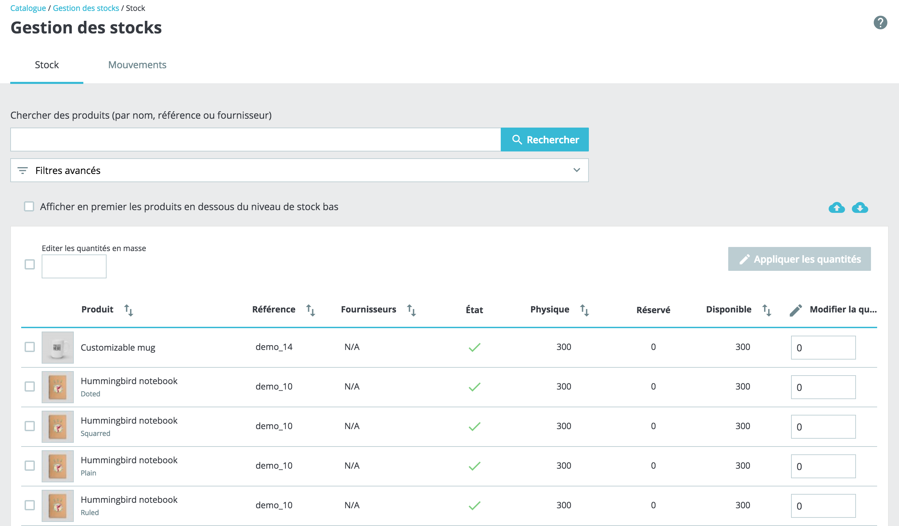
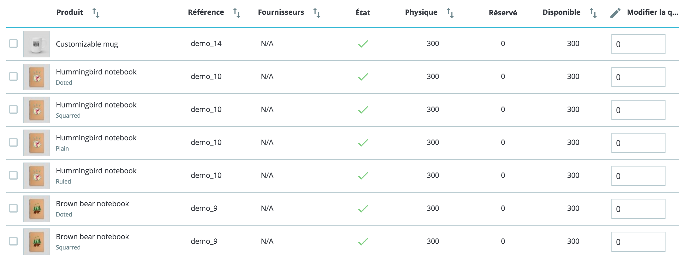
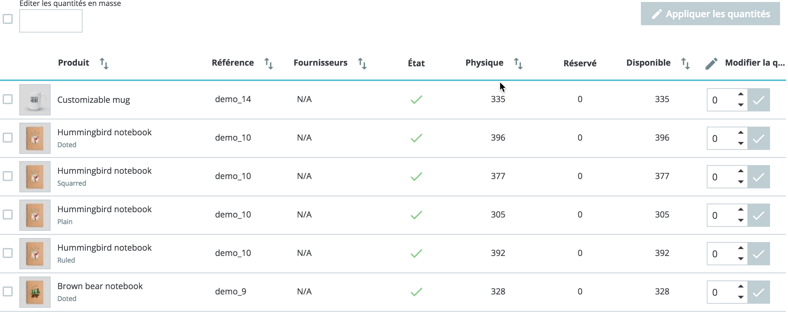
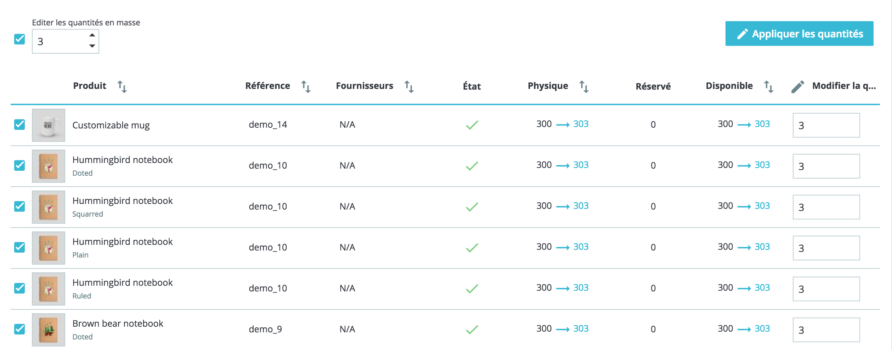
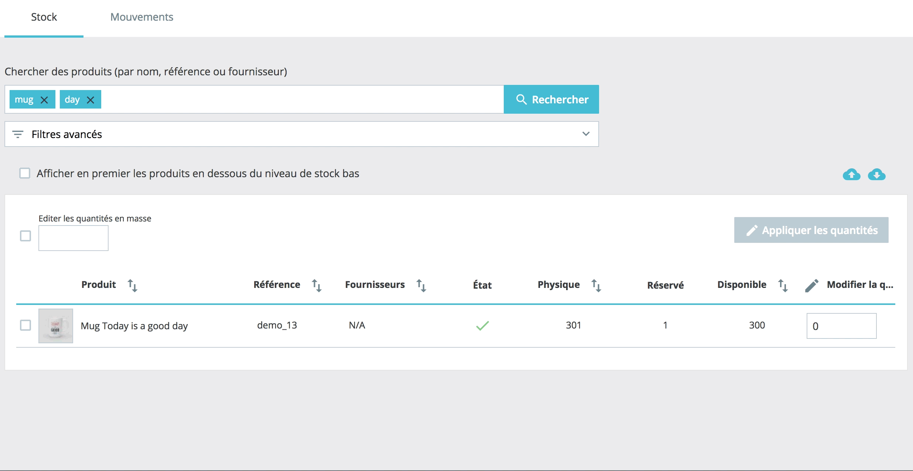
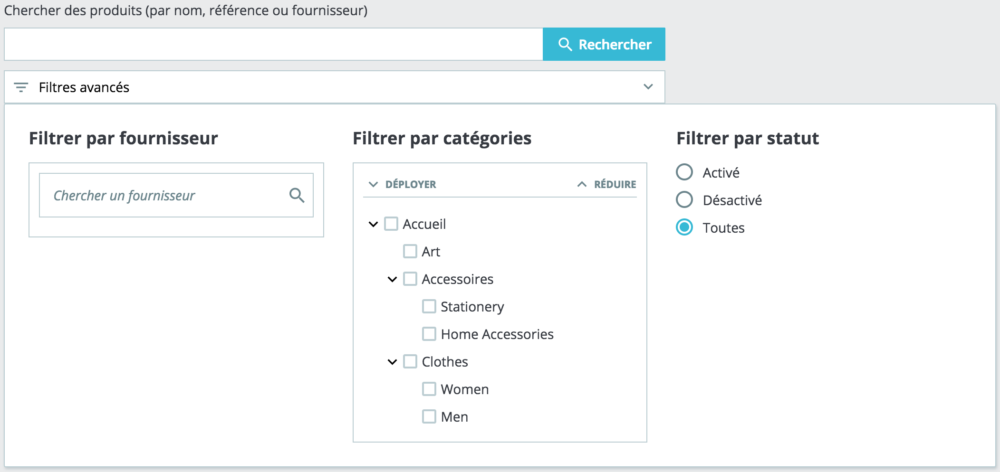
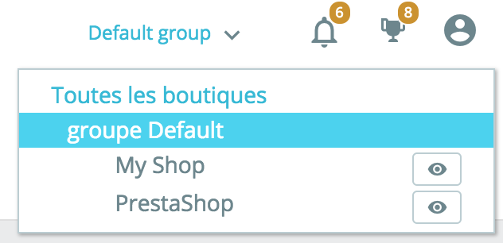

# Stocks

Cet onglet comporte la liste de vos produits en stock ainsi qu'un outil de recherche pour vous permettre de mettre directement à jour la quantité de vos produits.

Cette liste vous permet de consulter en un coup d'oeil les stocks de votre catalogue.

Chaque ligne correspond à un produit (soit standard, virtuel ou en pack) ou à l'une de ses combinaisons. La seule différence ? Les attributs sont affichés juste sous le nom du produit !&#x20;

La liste contient les colonnes suivantes :

* Une vignette, pour reconnaître rapidement le produit.
* Le nom du produit et, s'il s'agit d'une combinaison, les valeurs de ses attributs.
* La référence du produit. Si une combinaison a sa propre référence, alors elle sera mentionnée à la place de la référence parente.
* Les fournisseurs. Si plusieurs fournisseurs sont rattachés à un même produit, seul le fournisseur par défaut sera mentionné.
* L'état, pour savoir si le produit est activé ou non.
* **Le stock physique**, qui correspond à la quantité actuellement présente dans votre stock.
* **Le stock réservé**, qui correspond à la quantité de produits dont la commande est en cours de traitement.
* **Le stock disponible**, qui correspond à la quantité disponible à la vente.
* Modifier la quantité. Cette entrée permet de modifier manuellement la quantité. Voir ci-dessous.

Comprendre la différence entre stock physique, stock réservé et stock disponibleDepuis la version 1.7.2.0, PrestaShop distingue trois types de stock, différents de ceux utilisés dans les versions 1.6.

* **Le stock physique**, c'est la quantité actuellement et physiquement présente dans votre stock. Vous pouvez ajouter ou supprimer du stock physique, par exemple lorsque vous recevez une commande du fournisseur ou procédez à un ajustement suite à un inventaire.
* **Le stock réservé**, c'est la quantité de produits dont la commande est en cours de traitement. En d'autres termes, ces produits sont physiquement présents dans votre stock mais ne sont plus disponibles à la vente puisqu'en cours d'achat. Il est impossible de procéder à la modification du stock réservé car il dépend uniquement des commandes des clients.
* **Le stock disponible**, c'est la quantité disponible à la vente. Contrairement à la version 1.6, il est impossible de modifier directement le stock disponible sans modifier le stock physique, celui qu'on retrouve dans la page "[Produit](http://doc.prestashop.com/pages/viewpage.action?pageId=51839058)".

Connexion entre les stocks physique, réservé et disponible

Ces trois types de stock résultent toujours de l'équation suivante :

_Stock physique - Stock réservé = Stock disponible_

Editer le stock physique modifie donc le stock disponible, et inversement. Par défaut, les produits sont classés par ordre décroissant, selon le numéro du produit. C'est-à-dire que le dernier produit créé se situe en haut de la liste. Chaque page peut contenir jusqu'à 100 produits et déclinaisons, au-delà de ce chiffre, une deuxième page est créée.

### Modifier les quantités 

Les quantités peuvent être modifiées directement dans l'onglet "Stock", à l'aide du champ d'entrée situé en haut à droite qui constitue la dernière colonne du tableau.

#### L'édition simple 

Pour éditer le stock d'un produit, ajoutez simplement la quantité désirée dans le champ d'entrée de la dernière colonne. Ce doit être une quantité delta. En d'autres termes, il ne s'agit pas de renseigner la quantité totale d'un produit mais la quantité que vous ajouter ou supprimer. Vous avez alors le choix entre taper manuellement la quantité ajoutée ou supprimée (incluant le signe moins, -) ou utiliser les flèches pour ajuster la quantité..gif>)Pour valider le nouveau stock, cliquez simplement sur la flèche bleue à droite de ce champ d'entrée ou sur le bouton "Appliquez les quantités" situé en haut à droite du tableau. En modifiant la quantité de votre stock, vous aurez une vue d'ensemble du stock final : Cette fonctionnalité vous permet de lire en même temps le point de départ, le point final et la différence entre les deux, avant de valider. Mais n'oubliez pas que les stocks physique et disponible sont liés par cette équation, il est donc nécessaire de les éditer tous les deux.

#### L'édition multiple 

Si vous voulez éditer plusieurs quantités en une seule fois, vous pouvez aussi modifier toutes les quantités voulues avant de cliquer sur le bouton "Appliquez les quantités".

#### L'édition en masse 

Depuis la version 1.7.3 de PrestaShop, vous pouvez aussi éditer les quantités de tous vos produits en masse. C'est très pratique et très facile : il suffit seulement de cocher la case dédiée (en haut à gauche de la liste), tous les articles seront sélectionnés par défaut mais vous pouvez ajuster cette liste à vos besoins, et d'entrer la quantité que vous souhaitez ajouter ou soustraire à votre stock avant de cliquer sur le bouton "Appliquez les quantités" !

### Alertes de stock 

Vous souhaitez être prévenus lorsque le niveau de stock d'un produit est bas ? Vous pouvez définir un seuil général dans la page "Produits" de l'entrée "Paramètres de la boutique" du menu ou l'effectuer directement depuis l'onglet "Quantités" d'une fiche produit. Une possibilité, accessible depuis la version 1.7.3 du logiciel, qui vous permet depuis la page de gestion des stocks d'afficher en priorité les articles dont le niveau de stock est sous le seuil fixé. Ils apparaîtront donc en haut de la liste.

### Options de recherche et de filtre 

En haut de la liste, deux éléments vous permettent de retrouver rapidement un produit. La barre de recherche est utile dans les cas où vous connaissez le produit recherché : référence, nom ou fournisseur. Les filtres de recherche avancée, quant à eux, vous permettent de sollicter plus d'options et d'affiner ainsi votre recherche.

#### La barre de recherche 

La barre de recherche permet de retrouver :

* le nom du produit&#x20;
* la référence du produit
* le fournisseur
* **\[**_**beta as of 1.7.2.0**_**]** les valeurs des attributs. Cela vous permet de rechercher un attribut spécifique, comme la couleur d'un produit. En tapant "vert", par exemple, vous affichez tous les produits qui partagent cette valeur d'attribut. Du fait qu'il ne s'agisse encore que d'une version bêta, cette option de recherche ne fonctionne pas avec les valeurs d'attributs courtes comme les tailles : "S", "M" ou "L".

#### Les filtres avancés 

Dans l'onglet "Stock", les filtres avancés sont :

* un filtre fournisseur, qui permet de faire défiler les fournisseurs disponibles et d'en choisir un ou plusieurs.
* un filtre catégorie avec une arborescence.
* un filtre statut, qui permet d'afficher les produits activés ou désactivés.\
  \

## Import / Export 

Parce que votre activité draîne avec elle beaucoup de données importantes, PrestaShop vous permet d'importer ou d'exporter les informations de cette page sous un fichier CSV. Pourquoi ? Pour que vous puissiez suivre la gestion de vos stocks en toute circonstance. Cliquez sur les petits pictogrammes bleus en forme de nuage qui se situent en haut à droite de la page pour profiter de ce système d'import/export.

## Multiboutique 

La bonne nouvelle, c'est que ce nouveau système de gestion des stocks est compatible avec les multiboutiques. Evidemment, si vous avez plusieurs boutiques au sein d'un même groupe mais que les stocks n'ont pas été mis en commun, vous ne pourrez pas les gérer à travers le groupe. Si vous essayez, vous verrez sans doute le message d'erreur suivant :

Vous devez donc sélectionner une boutique pour en modifier les stocks.\

En revanche, dans le cas où vous avez un groupe de boutiques qui partagent les mêmes quantités entre elles, vous n'avez qu'une seule boutique à sélectionner mais, cette fois-ci, les changements effectués sur cette boutique se répercutent sur les autres boutiques.

