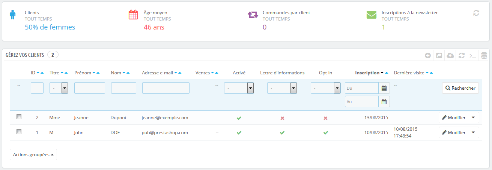
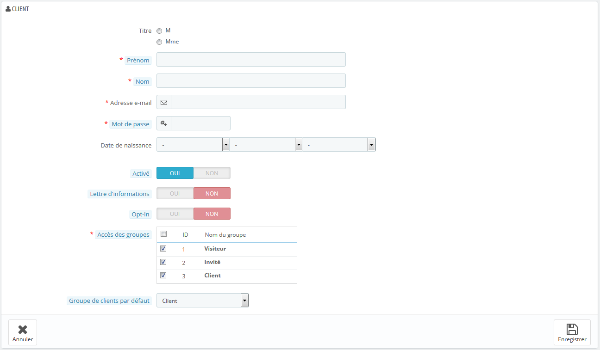
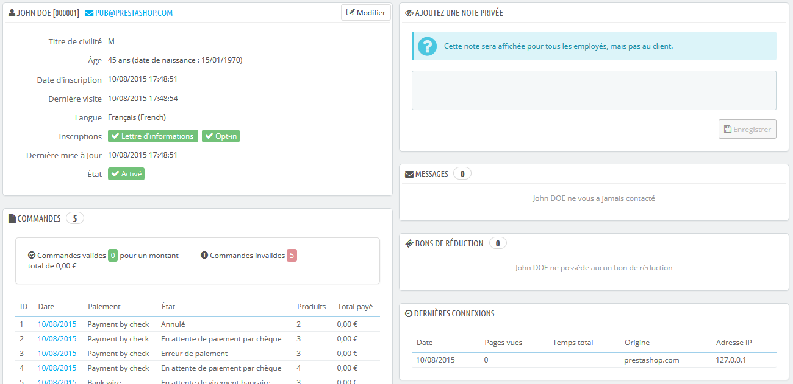
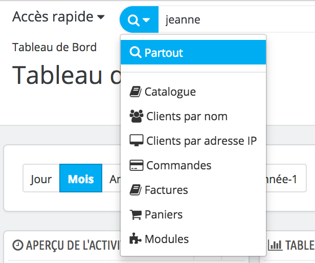

# Vos clients

La première page du menu "Clients" vous donne la liste de tous les utilisateurs enregistrés sur votre boutique.



Celle-ci vous donne un bon aperçu de l'ensemble de vos clients, avec quelques détails que vous pouvez utiliser pour trier les comptes ou lancer des recherches :

* **ID**. L'identifiant unique rattaché à ce client.
* **Titre de civilité**. Le client peut indiquer son titre de civilité, qui peut être genré ou non, et peut vous aider à mieux personnaliser l'utilisation de votre boutique par vos clients. Il y a deux titres de civilité par défaut : "M." et "Mme" mais vous pouvez en créer d'autres à l'aide de la page "Titres de civilité" du menu "Clients" dans "Paramètres de la boutique".
* **Nom et prénom**. Le nom du client.
* **Adresse e-mail**. L'addresse e-mail que le client a utilisée pour s'inscrire sur votre site.
* **Ventes**. Combien le client a déjà dépensé sur votre boutique.
* **Activé**. Indique si le compte est actif ou non. Vous pouvez désactiver un compte en cliquant sur la coche verte.
* **Lettre d'informations**. Indique si le client est inscrit à votre newsletter ou non. Vous pouvez le désinscrire en cliquant sur la coche verte.
* **Offres partenaires**. Indique si le client accepte de recevoir des messages de vos partenaires ou non. Vous pouvez le désinscrire en cliquant sur la coche verte. **N'inscrivez pas vos clients à ces messages sans leur accord, car cela peut être considéré comme du spam**.
* Inscription et dernière visite peuvent se révéler utile pour trier les comptes.
* **Actions**. Vous pouvez modifier le compte d'un utilisateur, simplement afficher ses données (dont ses messages, commandes, adresse, bons de réduction, etc.), ou le supprimer définitivement.

Lors de sa première installation avec des données de démonstration, PrestaShop crée un utilisateur par défaut, nommé John Doe.

Vous pouvez utiliser cet utilisateur pour tester les fonctionnalités de votre boutique, et plus généralement pour en parcourir les pages comme le ferait un utilisateur normal.

Pour vous connecter à votre boutique avec ce compte, utilisez ces identifiants :

* Adresse e-mail : [pub@prestashop.com](mailto:pub@prestashop.com)
* Mot de passe : 123456789

**Avant d'ouvrir votre boutique au grand public, supprimez cet utilisateur par défaut, ou au moins changez ses identifiants !** En effet, des utilisateurs malveillants pourraient s'en servir pour créer de fausses commandes, voire pire.

Sous la liste des clients se trouve le bouton "Définir les champs requis pour cette section". Il ouvre un formulaire que vous pouvez utiliser pour indiquer si un champ de la base de données est nécessaire ou non, en cochant les cases appropriées : ainsi, vous pouvez rendre le champ "offres partenaires" obligatoire lorsqu'un visiteur crée un compte utilisateur sur votre boutique.

Vous pouvez exporter une liste de vos clients avec le bouton "Exporter" situé en haut.\
Vous pouvez également importer des clients en utiliser le bouton "Import". Il vous faudra un fichier CSV au format suivant :

```
ID;Title;Last name;First Name;Email address;Age;Enabled;News.;Opt.;Registration;Last visit;
2;1;Gorred;Francis;francis@example.com;-;1;0;0;2013-07-04 15:20:02;2013-07-04 15:18:50;
1;1;DOE;John;pub@prestashop.com;43;1;1;1;2013-07-02 17:36:07;2013-07-03 16:04:15;
```

Plus d'informations sont disponibles dans le page "Import" du menu "Paramètres avancés".

## Créer un nouveau compte d'utilisateur <a href="#vosclients-creerunnouveaucomptedutilisateur" id="vosclients-creerunnouveaucomptedutilisateur"></a>

Pour créer vous-même un nouvel utilisateur, cliquez sur le bouton "Ajouter un nouveau client". Le formulaire s'ouvre.



Remplissez ses différents champs :

* **Titre**. Choisissez l'un de ces titres de civilité disponibles, ou créez-en un nouveau avec la page "Titres de civilité" du menu "Clients" des "Paramètres de la boutique".
* **Prénom**, **Nom**, **Adresse e-mail**. Ces informations sont essentielles : les noms sont utilisés dans les e-mails que PrestaShop envoie, et l'adresse e-mail est utilisée pour la connexion.
* **Mot de passe**. Choisissez un mot de passe, d'au moins 5 caractères de long.
* **Date de naissance**. Cette information peut être utilisée pour les e-mails d'anniversaire, et les promotions temporaires.

Si vous ne souhaitez pas demander la date de naissance lors qu'un client s'inscrit sur votre site, vous pouvez désactiver ce champ dans le menu "Clients" des "Paramètres de la boutique". Sélectionnez simplement "Non" pour l'option "Demander la date de naissance".

* **Activé**. Vous pourriez souhaiter créer un compte, mais ne pas l'activer aussitôt.
* **Offres partenaires**. Peut être utilisé par des modules pour envoyer régulièrement des promotions de vos partenaires aux clients qui en ont fait la demande. **N'inscrivez pas vos clients à ces messages sans leur accord, car cela peut être considéré comme du spam**.
* **Accès des groupe**. Le fait de créer des groupes de clients vous permet de créer des promotions pour ces groupes. De nombreuses fonctionnalités de PrestaShop peuvent être appliquées à un certain groupe seulement.
* **Groupe par défaut**. Quel que soit le nombre de groupes auxquels le client appartient, il doit toujours appartenir à un groupe principal.

Si vos clients sont surtout des sociétés, vous devriez activer le mode B2B afin d'avoir des options supplémentaires : rendez-vous dans le page "Clients" du menu "Paramètres de la boutique", et choisissez "Oui" pour l'option "Activer le mode B2B".


Le mode B2B ajoute des champs propres aux sociétés :

* **Société**. Le nom de la société.
* **SIRET**. Son numéro SIRET (seulement pour la France).
* **APE**.  Son code d'activité principale (_Activité principale exercée_ - seulement pour la France).
* **Site web**. Son adresse web.
* **Encours autorisé**. Le montant de l'encours autorisé pour cette société.
* **Délai de paiement maximum (en jours)**. Le délai autorisé avant règlement des factures.
* **Niveau de risque**. Votre estimation du risque de cette société : aucun, faible, moyen, élevé.

## Afficher les informations relatives à un client <a href="#vosclients-afficherlesinformationsrelativesaunclient" id="vosclients-afficherlesinformationsrelativesaunclient"></a>

Dans le cas où vous voudriez avoir plus d'informations sur un client donné, vous pouvez cliquer sur le bouton "Afficher", situé à la fin de sa ligne dans la liste des clients. Une nouvelle page s'ouvre.



Les sections de cette page vous présentent les données clé de cet utilisateur :

* **Informations sur le client**, son nom et prénom, e-mail, genre, date d'inscription, date de la dernière visite.
* Information par rapport à sa souscription à la newsletter de la boutique et souscription à des publicités d'entreprises partenaires, son âge, date de sa dernière mise à jour, compte actif ou non.
* **Note privée** de la part des employés de la boutique (vous ou votre équipe).
* **Messages** envoyés par l'utilisateur à l'équipe (via le service après-vente).
* Ses **bons de réduction** disponibles.
* Sa **dernière connexion**.
* Les **groupes** auxquels le client appartient.
* Les **paniers** que le client a créé (mais pas forcément validé) depuis son inscription. Quand votre client est sur votre site, vous pouvez voir ce qu'il ajoute à son panier en temps réel.
* **Résumé des achats** déjà effectués par le client. Montant dépensé, type de paiement, état des commandes. Pour plus d'informations sur chaque commande, cliquez sur le numéro de commande.
* Résumé des **produits qui ont été visualisés** par un client. Entre autres choses, cela vous permet de savoir quand un client aime beaucoup un certain produit, et donc par exemple de lui créer une réduction pour sa 10e commande. En cliquant sur le produit, vous êtes renvoyé vers la fiche produit.
* Ses différentes adresses.\
  \


## Chercher un client <a href="#vosclients-chercherunclient" id="vosclients-chercherunclient"></a>

Vous avez deux manières de chercher un client dans votre boutique PrestaShop.

**La première méthode** consiste à saisir les informations dont vous disposez dans le moteur de recherche interne, qui se trouve tout en haut de votre back-office. En sélectionnant "tout", "par nom" ou "par adresse IP", vous pouvez lancer des recherches sur :

* ID. Le nombre assigné au client dans votre base de données.
* Prénom ou nom. Notez que vous ne pouvez pas lancer une recherche sur les deux combinés : utilisez "john" ou "doe", car "john doe" ne donnera pas de résultat.
* Adresse e-mail.
* Adresse IP. Vous pouvez lancer une recherche avec l'adresse IP de sa dernière connexion à votre boutique.



Les résultats, s'il y en a, sont affichés ensuite : la liste vous donne l'ID des utilisateurs, avec titre de civilité, adresse e-mail, anniversaire, date d'inscription, nombre de commandes et état du compte. De là, vous pouvez accéder à la page complète de l'utilisateur, ou en modifier les détails.


**La seconde méthode** consiste à aller dans la page "Clients", et utiliser la liste des clients.


En effet, vous pouvez remplir les champs en haut de la liste, afin de filtrer le contenu en fonction des critères suivants : ID, titre de civilité, prénom, nom, adresse e-mail, âge, état du compte, inscription à la newsletter, inscription aux promotions partenaires, date d'inscription, et date de dernière connexion. Saisissez vos critères puis cliquez sur le bouton "Filtre" situé du côté droit du tableau. Vous pouvez ensuite trier la liste en fonction de chaque colonne.

Cliquez sur le bouton "Réinitialiser" pour revenir à la liste complète.
