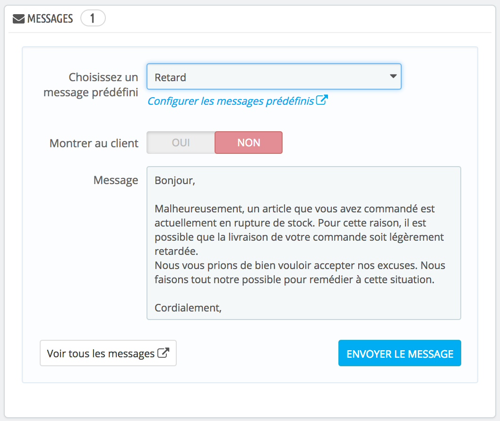

# Messages prédéfinis

Lorsque vous devez envoyer un message à vos clients en utilisant l'interface PrestaShop (sur la page des commandes), vous pouvez choisir d'enregistrer ce message afin de le renvoyer à d'autres clients avec des questions et des commentaires similaires.

Pour ce faire, allez dans la page "Message prédéfinis" du menu "Service client". Un message est déjà enregistré par défaut : "Délai".

## Créer de nouveaux messages 

Pour ajouter d'autres messages prédéfinis, cliquez sur le bouton "Ajouter un nouveau message de commande". Vous pouvez également modifier le message par défaut.

Le formulaire va à l'essentiel :

* **Nom**. Indiquez l'objet de votre message, afin qu'il soit facilement retrouvable par la suite.
* **Message**. Écrivez le contenu que vous souhaitez envoyer à vos clients.

Une fois ces champs remplis, cliquez sur "Valider".

Vous pouvez créer autant de messages que vous voulez.

## Envoyer un message prédéfini à un client 

Une fois que vos messages prédéfinis sont en place, vous pouvez les envoyer en allant directement sur la commande d'un client :

1. Sélectionnez le message.
2. Modifiez-le si besoin est, afin de le personnaliser pour la commande ou le client.
3. Activez l'option "Montrer au client"
4. Cliquez sur "Envoyer".\
   \
   

Votre client recevra le message sur le compte e-mail associé à son compte utilisateur. Pour continuer la conversation, rendez-vous dans la page "Service client" du menu "Clients".
